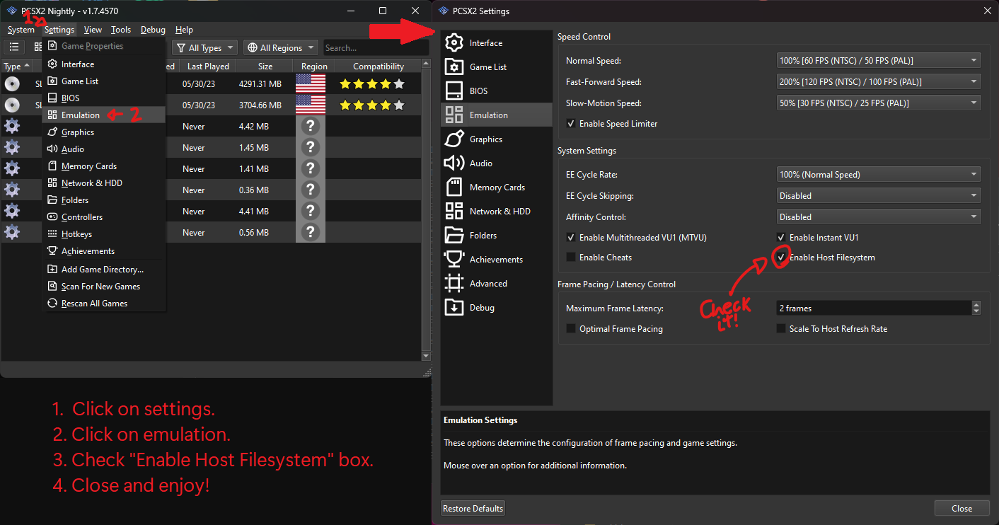
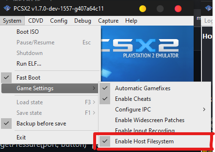

<h1>PS2 port of Envy Desktop WebUI</h1>

Envy's port for the PS2 is not very usable as of right now, still requiring a lot of bugfixes.

<h2>How to run Envy on your PS2 (real hardware or emulator)</h2>
- If you are opening it on PlayStation 2 (every console except for the Slim 9000 series), just open the `.elf` file normally through uLaunchELF.
- If you are opening it on PlayStation 2 (Slim 9000 series), compile an ISO via the compilation guide, burn and run the ISO.
- If using PCSX2, you need to activate **hostfs** and open the '.elf' file.
<i>New (Qt)</i>

<i>Old (WxWidgets)</i>
