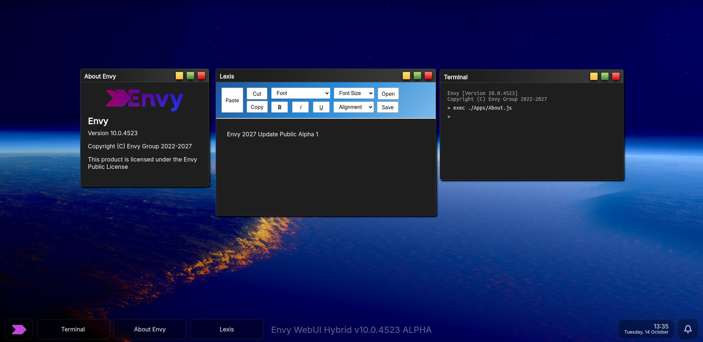

<span style="display:block;text-align:center"></span>
<p>Developer? We reccomend reading up on the <a href="/Docs/README.md">Envy Hybrid API Documentation</a>.</p>
> [!NOTE]
> We have limited resources/time at the moment, if you want to contribute you are free to do so.

> [!NOTE]
> Please note that this is also a pre-release version of Envy and that bugs and issues may arise.

<p>Envy is a upcoming OS for any type of device, wherever it is a measly thin PC or a full blown server or workstation, Envy likely has a version for that.</p>

<p>This repo contains everything you need to run:</p>
<li>Envy Aiya</li>
<li>Envy Kernel</li>
<li>Envy Go (Envy Mobile UI)</li>
<li>Envy Legacy Compatibilty (Cherry Tree, eWinBox)</li>
<li>Envy WebUI</li>
<h2>Download Envy</h2>
| Device type    | Envy flavor | Download (Architecture)                                 | Compile guide |
|----------------|-------------|---------------------------------------------------------|---------------|
| Embedded       | Server      | i386 (BIOS, UEFI) \| AMD64 (BIOS, UEFI) \| ARM64 (UEFI) | Server guide  |
| Desktop/Laptop | Hybrid      | i386 (BIOS, UEFI) \| AMD64 (BIOS, UEFI) \| ARM64 (UEFI) | Hybrid guide  |
| Mobile         | Go          | ARM32 (WIM, UEFI) \| ARM64 (WIM, UEFI)                  | Go guide      |
| Server         | Server      | AMD64 (BIOS, UEFI) \| ARM64 (UEFI)                      | Server guide  |
<h2>Directory structure</h2>

```
/os/
├── API                    # WebUI mini-apps that communicate with standard apps
├── Apps                   # WebUI applications (such as Filer)
│   └── Server             # Envy Server apps
├── Assets                 # Images, audio, etc
├── Cores                  # WebUI applications (such as Filer)
├── Docs                   # Documentation
├── Kernel                 # Envy Kernel
│   └── Drivers            # Envy Kernel drivers
│   └── System             # Envy Kernel source code
│       └── AMD64          # x86_64 specific code
│       └── armv8          # ARM64 specific code
│       └── i386           # x86_32 specific code
│       └── Neutral        # Architecture neutral code
├── Libs                   # Libraries needed for Envy WebUI
├── Packages               # Apps for Envy Legacy Compatibility
│   └── apps               # Legacy apps
│   └── system             # Legacy services
│   └── ui                 # Legacy desktop
├── Registry               # Envy Registry
│   └── local              # Local registry
│       └── Envy           # Envy-made registry
├── Styles                 # CSS for Envy WebUI
├── Submodules             # 3rd party repositories
├── Tools                  # Scripts, etc to help set up and run Envy
│   └── Compilation        # Scripts to help compile Envy Kernel
│   └── ML                 # Scripts to help train and run Envy Aiya
├── UI                     # Envy WebUI GUI
```
<h1>Self-hosting Envy WebUI (localhost)</h1>
<p>Read the <a href="./Docs/Localhost.md">Localhost documentation</a> for more information.</p>