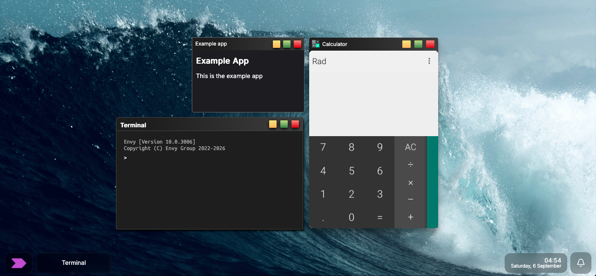

Developer? We reccomend reading up on the <a>Envy WebUI API Documentation</a>.

<h2>THIS IS A PRERELEASE VERSION!! EXPECT BUGS!!</h2>
<h1>Envy WebUI 2026 Update (10.0.3006.19)</h1>

This repo contains the base system to run Correr and GWM.

