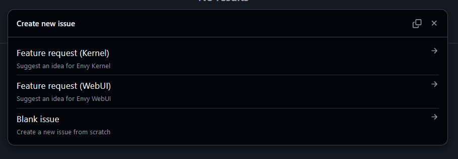

> [!NOTE]
> We have limited resources/time at the moment, if you want to contribute you are free to do so.

If you encounter any security issues that you know how to fix, please make a pull request through GitHub ASAP or alternatively send us the fix directly.

If you encounter a security issue that you don't know how to fix, make a issue on GitHub depending on if it is a issue with Envy Kernel and Envy WebUI

